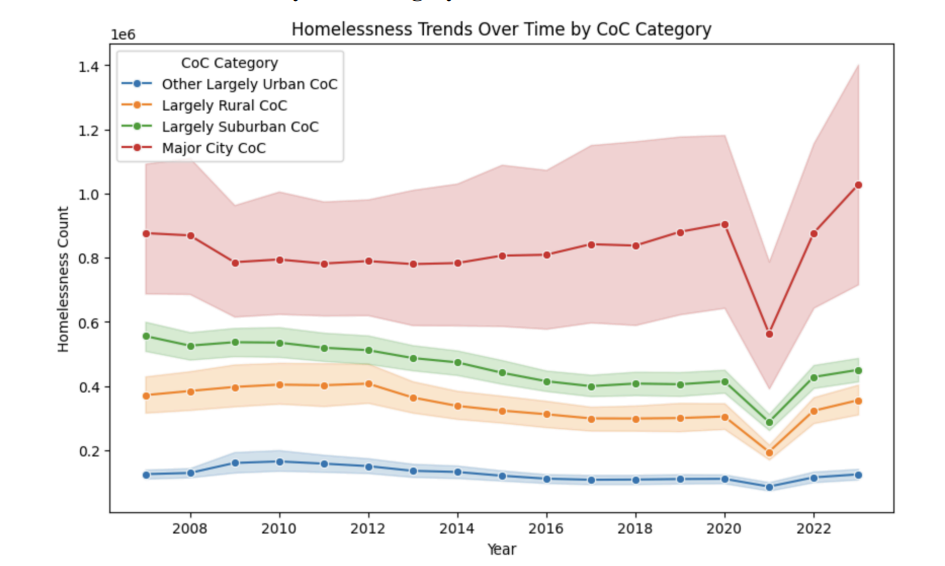
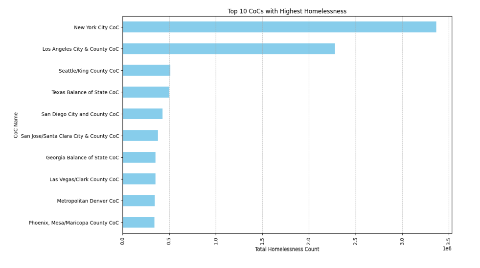
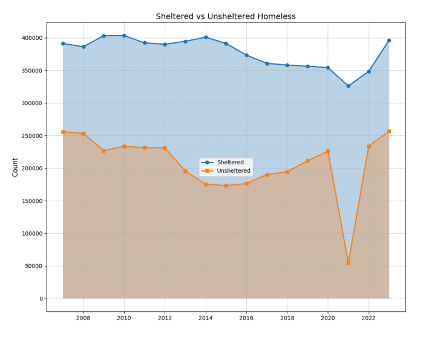

# Forecasting Homelessness: A Community Data Approach
## Background

The OECD, an economic consortium of developed nations, estimates that its member nations have, on average, 25 people per 10,000 who are unhoused [(Homelessness | OECD)](https://www.oecd.org/en/topics/sub-issues/affordable-housing/homelessness.html). Here in the United States, data from 2024 estimates that about 23 people per 10,000 are unhoused [(Homelessness statistics in the world: Causes and facts)](https://www.developmentaid.org/news-stream/post/157797/homelessness-statistics-in-the-world). Although it seems many wealthy nations struggle with housing their most vulnerable populations, one must ask if there is a better way.

According to a Finnish non-profit, "The ethical perspective means that homelessness has to be eliminated because human dignity belongs to everyone. A home is a human right [(Cook, 2025)](https://www.goodgoodgood.co/articles/finland-homeless-housing-first-approach)." According to research, the cost per person per year for homelessness is $18,247, while the cost of Housing First initiatives is $16,479 [(Systematic Research Review finds benefits of Housing First programs in U.S. outweigh costs 2022)](https://nlihc.org/resource/systematic-research-review-finds-benefits-housing-first-programs-us-outweigh-costs). Therefore, society has both a moral and economic impetus to scale successful initiatives efficiently. Understanding the nature and causes of the homeless population is vital in this effort.

A Boston University Project [(Aqeel, 2025)]([https://github.com/ao222/branching-out/blob/main/CREDITS.md#predictive-model-based-on-homelessness) built a model to predict the size of the homeless population in local areas based on economic and demographic data. They also identify the importance of each predictor to understand better what impacts the overall size of the homeless population. Identifying these factors could inform policymakers on strategy and policy development to help decrease homelessness. Predicting the number of people suffering homelessness in a local area could help assign resources to communities with the most need.

My project closely follows the project from Boston University. It seeks to affirm or reject their conclusions by reproducing their work, updating the dataset, and following up on their concluding recommendations to add ensemble methods with multiple objective optimization. I would also like to extend their visualizations in certain areas to highlight Houston's relative position with other communities.

## Review of Earlier Work

Boston University's Project organizes itself around two motivating questions. 1) To what extent can homelessness rates be predicted by measures of rent, poverty, and other housing market conditions? 2) What measures are most important in predicting homelessness? To achieve these ends, the team at BU collected demographic and economic indicators from the American Community Survey (ACS). It paired it with the Point-In-Time count (PIT) and the Housing Inventory Count (HIC) data collected by local Continuums of Care planning bodies within the U.S. Department of Housing and Urban Development (HUD). These two counts track the demand and supply of homeless services nationwide. Additionally, the BU team added average monthly temperatures by state provided by the National Oceanic and Atmospheric Administration (NOAA).

They used several visualizations to highlight key properties of the data. Below is one such visualization of homelessness trends over time.

### BU Visualizations

This visualization highlights a decrease in 2021 in the number of homeless individuals across all CoC types. Emergency housing initiatives during the COVID-19 pandemic likely contributed to these reductions. These measures were deemed unsustainable by the political system and scaled back after the pandemic subsided, which marks the rise in homelessness from 2022 and beyond.

This visualization highlights that urban CoCs take up a larger proportion of homelessness than the other categories. The BU report argues that policy initiatives must target these communities to address this disparity. Complicating this issue is the fact that a proportion of urban homelessness stems from individuals migrating from rural and suburban areas. Therefore, raw counts in the cities overestimate the number of homeless individuals their communities create. The data collected lacks the detail to investigate this dynamic.

Here we see that New York and LA have the highest counts, while Houston doesn't appear in the top ten. A rural CoC from Texas (Texas Balance of State) does make the top ten. However, this visualization doesn't account for the different population sizes. I will add a top ten per capita chart as well.

This chart aims to illustrate the composition of various types of homeless individuals. However, the author of this particular pie chart has made a mistake. Overall homelessness refers to the total homeless population. Unsheltered vs. sheltered is one division of this population. Families vs. individuals is another type of division. Combining both splits and the total count in one pie chart represents 300% of the popoulation! Therefore, this pie chart is erroneous and highlights the need for careful understanding of data when conducting visualizations.

The sheltered vs. unsheltered population plot shows that the unsheltered population dropped significantly during COVID, highlighting again the effectiveness of crisis interventions. However, the rebound in 2023 highlights the impact of systemic issues related to homelessness.

### Modeling

The BU team applied four classes of models to five different target variables, creating 20 models. The model classes compaired were: Linear Regression, Random Forest, Histogram-Gradient Boosting, and Extreme Gradient Boosting (XGBoost). Random forest had the best relative RMSE among the four, except in predicting individual and family homelessness, suggesting overfitting in this area.

### Conclusions

The BU team investigated the importance of the predictors in the different models. They conclude that the strongest predictors were the renter household rates and total year-round beds. Also strong were population size and average temperature. A third tier of predictors was median household income, unemployment rates, and poverty rates.

This predictor hierarchy suggests that regions with higher rent burdens and unemployment rates tend to have significantly higher homelessness rates, particularly in highly dense areas.

### Policy and Practical Recommendations

The BU team suggests that policymakers prioritize high-risk communities and stabilize rent by implementing rent control or subsidies. These initiatives would help alleviate housing costs for vulnerable populations. Also, enhancing shelter capacities is vital.

For further work, the BU team suggests incorporating real-time weather conditions and real-time economic fluctuations. They suggest exploring ensemble approaches that combine different models, such as Histogram-Gradient Boosting, Random Forest, and Support Vector Regression. A second suggestion was to implement multi-objective optimization. Some possible objectives might include the number of homeless veterans, the number of unsheltered youth, and the number of chronically homeless individuals.

The BU team suggests that policymakers could use these models to identify high-risk communities to address the most pressing needs. As well as comparing model predictions with actual outcomes to help policymakers evaluate the effectiveness of their policies against a baseline.

## Data

I obtained the data for this project from 'Predictive Model Based on Homelessness' located at this [GitHub repo](https://github.com/BU-Spark/ds-ciss-predictive-homlessness/tree/main). The file [Final_Dataset.csv](https://github.com/BU-Spark/ds-ciss-predictive-homlessness/blob/76d8be480f6b32075f4193776988ed61aac92687/Final_Dataset.csv) contains 20 columns prepared by combining various government datasets. Below are tables representing the 20 columns, their descriptions, and their sources. I obtained this information from the dataset documentation at the above repo.

### Data Descriptions
| Parameter	| Description | Sources |
|----|----|----|
|Total Population |	Total population of the local area (CoC coded area)|ACS Table 'B01003_001E'|
|Median Gross Rent |	Median gross rent for a 2-bedroom apartment.|ACS Table `B25031_004E`|
|Median Household Income	| Median household income in the past 12 months.|ACS Table `B19013_001E`|
|Poverty_Rate	| Poverty rate, indicating the percentage of individuals living below the poverty line.|ACS Table `B17001_001E`|
|Vacancy_Rate |	Percentage of rental properties that are vacant.|ACS Table `B25004_001E`|
|Renter_Household_Rate |	Percentage of households that are renter-occupied.|ACS Table `B25008_001E`|
|Cost_Burdened_Rate |	Percentage of renter households paying more than 30% of their income toward rent.|ACS Table `B25106_006E`, `B25106_010E`, `B25106_014E`, `B25106_018E`|
|Unemployment_Rate |	Unemployment rate, showing the percentage of the labor force that is unemployed.|ACS Table `B23001_001E`|
|Total Year-Round Beds (ES, TH, SH) |	the capacity of the homeless service system, number of permanent year-round beds across three program types.|HUD’s Housing Inventory Count (HIC)|
|Average Temperature |	January Average Temperature of the encompassing state| National Centers for Environmental Information (NOAA) |
|Overall Homeless |	All people experiencing homelessness| HUD's Point in Time Count|
|Overall Homeless Individuals |	People experiencing homelessness not in a family| HUD's Point in Time Count|
|Overall Homeless People in Families |	People experiencing homelessness part of a family unit| HUD's Point in Time Count|
|Unsheltered Homeless |	People experiencing homelessness unsheltered |HUD's Point in Time Count|
|Sheltered Total Homeless |	People experiencing homelessness in shelters| HUD's Point in Time Count|
|Overall_Homeless_Per_Capita |	People experiencing homelessness counts per capita| HUD's Point in Time Count|
|Overall_Homeless_Individuals_Per_Capita |	People experiencing homelessness counts per capita| HUD's Point in Time Count|
|Overall_Homeless_People_in_Families_Per_Capita |	People experiencing homelessness counts per capita| HUD's Point in Time Count|
|Unsheltered_Homeless_Per_Capita |	People experiencing homelessness popoulation counts per capita| HUD's Point in Time Count|
|Sheltered_Homeless_Per_Capita |	People experiencing homelessness popoulation counts per capita| HUD's Point in Time Count|

### Data Details

#### ACS Tables
The American Community Survey, produced by the Census Bureau, carries out 3.5 million surveys each year and is the leading survey informing federal policy. It releasese three data products: 1 year estimates, 1 year supplemental estimates, and 5 year estimates. These three products represent geographies of 65,000 for the 1-year estimates, geographies of 20,000 for the 1-year supplemental estimates, and drill down to neighborhood-level and rural counties for the 5-year estimates. In this project, I will use the 5-year estimates. The ACS ask questions regarding a wide area of topics in categories of social, economic, demographic, and housing. These areas are delimited below.

|Social|Economic|Demographic|Housing|
|------|--------|-----------|-------|
Ancestry|Class of Worker|Age|Computer & Internet Use
Citizenship|Commuting|Hispanic Origin|Costs (Mortgage, Rent, Taxes, Insurance)
Citizen Voting Age Population|Employment Status|Race|Heating Fuel
Disability|Food Stamps (SNAP)|Relationship|Home Value
Educational Attainment|Health Insurance|Sex|Occupancy
Fertility|Hours/Week, Weeks/Year| |Plumbing/Kitchen Facilities
Grandparents|Income| |Structure
Language|Industry & Occupation| |Tenure (Own/Rent)
Marital Status| | |Utilities
Migration| | |Vehicles
School Enrollment| | |Year Built/ Year Moved In
Veterans| | |

#### Housing Inventory Count (HIC)

The Housing Inventory Count (HIC) is a snapshot of all the programs within a Continuum of Care (CoC) that offer beds and units specifically for people experiencing homelessness. For permanent housing projects, this includes people who were homeless when they first entered, based on HUD's definition. There are five program types, each with its specific count: Emergency Shelter, Transitional Housing, Rapid Re-Housing, Safe Haven, and Permanent Supportive Housing [https://www.hudexchange.info/programs/hdx/pit-hic/#2025-pit-count-and-hic-guidance](https://www.hudexchange.info/programs/hdx/pit-hic/#2025-pit-count-and-hic-guidance).

#### Point-in-Time Count (PIT)

The Point-in-Time (PIT) Count is a one-night count conducted in January that provides a snapshot of how many people are experiencing homelessness, both sheltered and unsheltered. HUD requires Continuums of Care (CoCs) to conduct this count each year for people staying in emergency shelters, transitional housing, and Safe Havens. In addition, CoCs must count unsheltered individuals every other year (in odd-numbered years). Each community is responsible for planning, organizing, and carrying out the count locally. [https://www.hudexchange.info/programs/hdx/pit-hic/#2025-pit-count-and-hic-guidance](https://www.hudexchange.info/programs/hdx/pit-hic/#2025-pit-count-and-hic-guidance)

#### NCEI

NOAA's statewide temperature data comes from thousands of weather stations, checked for accuracy and adjusted for changes in equipment or location. These readings are mapped onto a fine grid and averaged to give reliable monthly statewide values, providing a consistent record of U.S. climate back to 1895.

## Methods

I begin by exploring models using PyCaret. PyCaret is a Python library which automates much of the machine learning workflow. I use it to build and evaluate many predictive models. I chose the overall homeless population per capita as the target variable. I will manually examine the best performing models in more depth. Below is a leaderboard created by my [PyCaret run](../Notebooks/automl.ipynb).

### Leaderboard
| Model Abv. | Model                           | MAE    | MSE | RMSE   | R2      | RMSLE  | MAPE   | TT (Sec) |
|------------|---------------------------------|--------|-----|--------|---------|--------|--------|----------|
| catboost   | CatBoost Regressor              | 0.0004 | 0   | 0.0007 | 0.8198  | 0.0007 | 0.2992 | 1.93     |
| et         | Extra Trees Regressor           | 0.0004 | 0   | 0.0008 | 0.8146  | 0.0008 | 0.2764 | 0.219    |
| lightgbm   | Light Gradient Boosting Machine | 0.0005 | 0   | 0.0008 | 0.7824  | 0.0008 | 0.3153 | 0.171    |
| rf         | Random Forest Regressor         | 0.0004 | 0   | 0.0008 | 0.7746  | 0.0008 | 0.305  | 0.635    |
| gbr        | Gradient Boosting Regressor     | 0.0005 | 0   | 0.0009 | 0.725   | 0.0009 | 0.391  | 0.25     |
| dt         | Decision Tree Regressor         | 0.0006 | 0   | 0.0011 | 0.5744  | 0.0011 | 0.3784 | 0.031    |
| lr         | Linear Regression               | 0.0009 | 0   | 0.0014 | 0.3476  | 0.0014 | 0.7438 | 1.025    |
| ridge      | Ridge Regression                | 0.0009 | 0   | 0.0014 | 0.3476  | 0.0014 | 0.7438 | 0.019    |
| br         | Bayesian Ridge                  | 0.0009 | 0   | 0.0014 | 0.3476  | 0.0014 | 0.7438 | 0.022    |
| lar        | Least Angle Regression          | 0.001  | 0   | 0.0015 | 0.2864  | 0.0015 | 0.8023 | 0.035    |
| en         | Elastic Net                     | 0.0011 | 0   | 0.0016 | 0.1413  | 0.0016 | 0.9777 | 0.019    |
| lasso      | Lasso Regression                | 0.0011 | 0   | 0.0017 | 0.1103  | 0.0016 | 0.9904 | 0.023    |
| llar       | Lasso Least Angle Regression    | 0.0011 | 0   | 0.0017 | 0.1103  | 0.0016 | 0.9904 | 0.021    |
| knn        | K Neighbors Regressor           | 0.0011 | 0   | 0.0017 | 0.0082  | 0.0017 | 0.9656 | 0.029    |
| dummy      | Dummy Regressor                 | 0.0012 | 0   | 0.0018 | -0.002  | 0.0018 | 1.067  | 0.02     |
| omp        | Orthogonal Matching Pursuit     | 0.0012 | 0   | 0.0018 | -0.0028 | 0.0018 | 1.0725 | 0.021    |
| ada        | AdaBoost Regressor              | 0.0017 | 0   | 0.0019 | -0.1903 | 0.0019 | 1.9042 | 0.104    |
| huber      | Huber Regressor                 | 0.0015 | 0   | 0.0023 | -0.6555 | 0.0022 | 0.8256 | 0.023    |
| par        | Passive Aggressive Regressor    | 0.0018 | 0   | 0.0025 | -1.073  | 0.0025 | 1      | 0.026    |

The leaderboard shows several gradient boosting decision tree regression algorithms (CatBoost Regressor, Light Gradient Boosting, and Gradient Boosting Regressor) as reducing the RMSE and increasing R^2 the most. I will select CatBoost for further exploration. Also competing with gradient boosting for the top spot are random forest algorithms (Extra Trees Regressor, Random Forest Regressor). I will choose one of these methods to explore further. Therefore, we will pit bagging (random forests) and boosting against each other using two different ensemble learning algorithms. My third chosen method will be the K-Neighbors Regressor, which has the next highest RMSE compared to the bagging and boosting algorithms.

## Tentative Task Schedule

| Week Number  | Due Date   | Task|
|--------------|------------|------|
| Week 1       | Sept. 27th | Gather ACS Tables|
|        |  | Merge ACS Tables, Coc Counts, NOAA Weather Data|
| Week 2       | Oct. 4th   | Create Per Capita and other Features|
|        |    | Determine Type of Variables|
|        |    | Identify outliers and any data issues|
|        |    | Apply Transformations|
|        |    | Handle missing values|
|        |    | Describe data variable statistics|
| Week 3       | Oct. 11th  | Visualize Data|
|        |   | Point out interesting relationships and patterns from visualizations|
| Week 4       | Oct. 18th  | 5 page Write-Up|
| **Report 2**     | **Oct. 25th**  |   |
| Week 5       | Oct. 25th  | Explain CatBoost, Extra Trees Regressor, and K-Neighbors Regressor Include model assumption advantages and disadvantages of each method |
| |            | Describe any feature creation|
|        |   | Explain the selection process and cross-validation used|
|        |   | Explain bias variance trade-off|
| Week 6       | Nov. 1st   | Construct CatBoost Model|
|        |    | Construct Extra Trees Regressor Model|
|        |    | Construct K-Neighbors Regressor Model|
| Week 7       | Nov. 8th   | Tune Model Hyperparameters|
|        |    | Interpret model coefficients and feature importance|
| Week 8       | Nov. 15th  | 5 Page Write-Up|
| Week 9       | Nov. 23rd  | Presentation Slides|
| **Presentation** | **Nov. 23rd**  |   |
| **Final Report** | **Nov. 30th**  |   |

## Works Cited
Cook, M. (2025, April 18). Finland lowered homelessness by 75% - here’s their secret. Good Good Good. https://www.goodgoodgood.co/articles/finland-homeless-housing-first-approach 
Homelessness statistics in the world: Causes and facts. DevelopmentAid. (n.d.). https://www.developmentaid.org/news-stream/post/157797/homelessness-statistics-in-the-world 
Homelessness | OECD. (n.d.). https://www.oecd.org/en/topics/sub-issues/affordable-housing/homelessness.html 
Systematic Research Review finds benefits of Housing First programs in U.S. outweigh costs. National Low Income Housing Coalition. (2022, November 21). https://nlihc.org/resource/systematic-research-review-finds-benefits-housing-first-programs-us-outweigh-costs 

## Credits

This project makes use of the following open-source work:

### Predictive Model Based on Homelessness

- **Author/Organization:**
Client Team:
Dr. Tom Byrne
Associate Professor, School of Social Work, BU
Dr. Molly Richard
Postdoctoral Associate, Center for Innovation in Social Science, BU

Instructor: Prof. Thomas Gardos

Technical Project Manager (TPM): Dhruv Shah
Project Manager (PM): Jasmine Dong

Team Members:
Syeda Shehrbano Aqeel (team lead)
Samritha Aadhi Ravikumar
Kunshu Yang
Renjie Fan
Shiheng Xu

- **License:** GNU General Public License v3.0 (GPL-3.0)  
- **Source:** [https://github.com/BU-Spark/ds-ciss-predictive-homlessness](https://github.com/BU-Spark/ds-ciss-predictive-homlessness)
