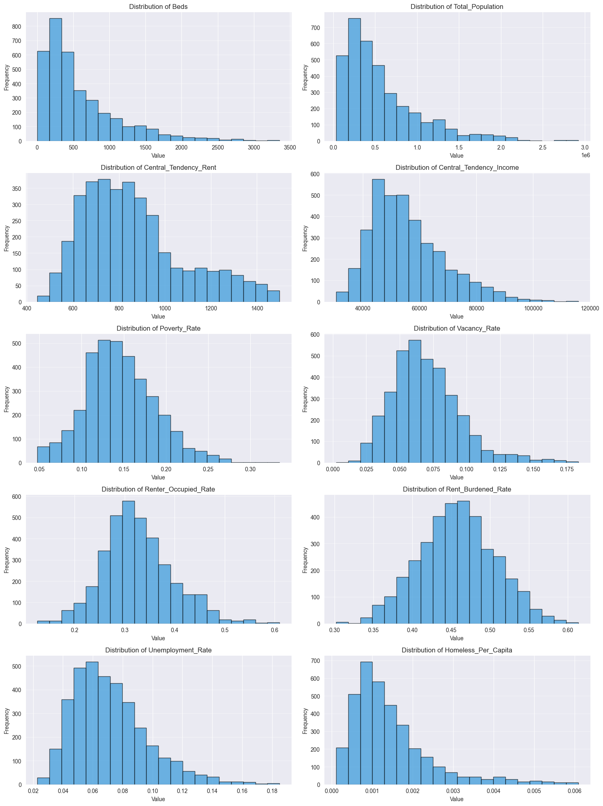
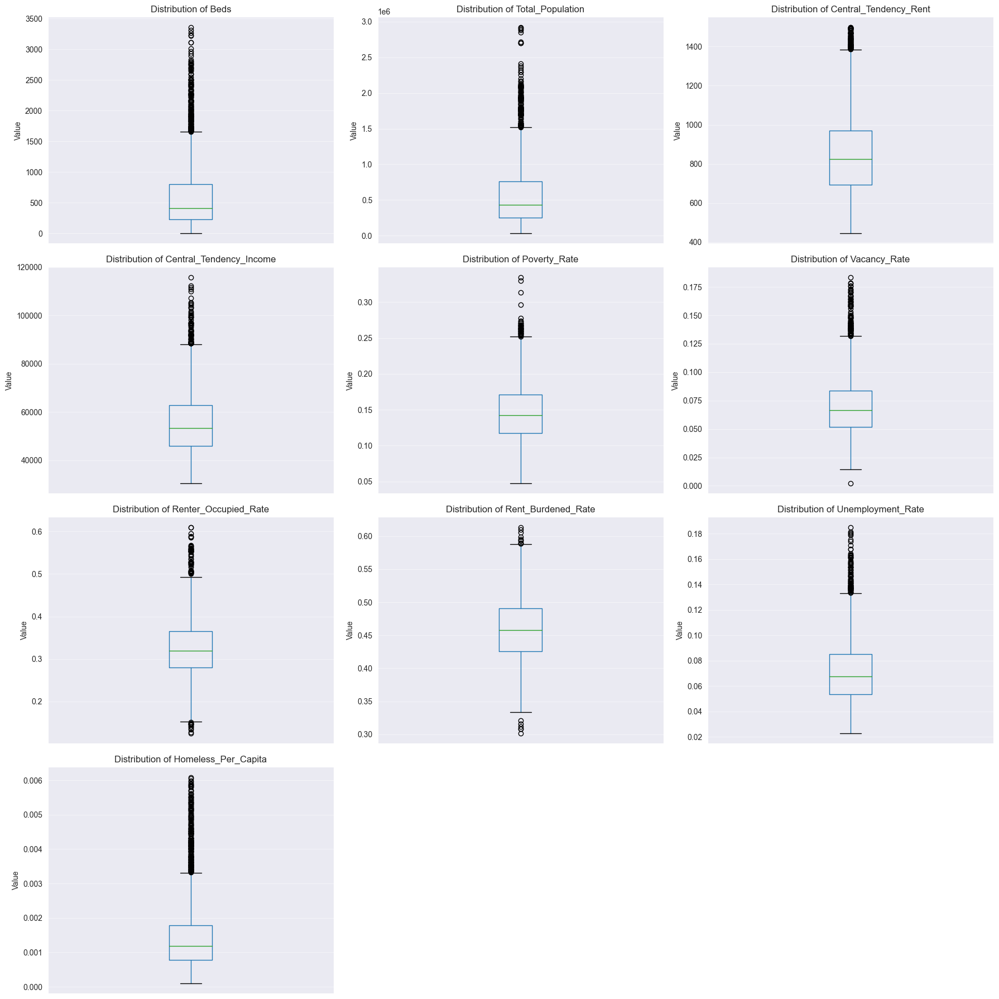
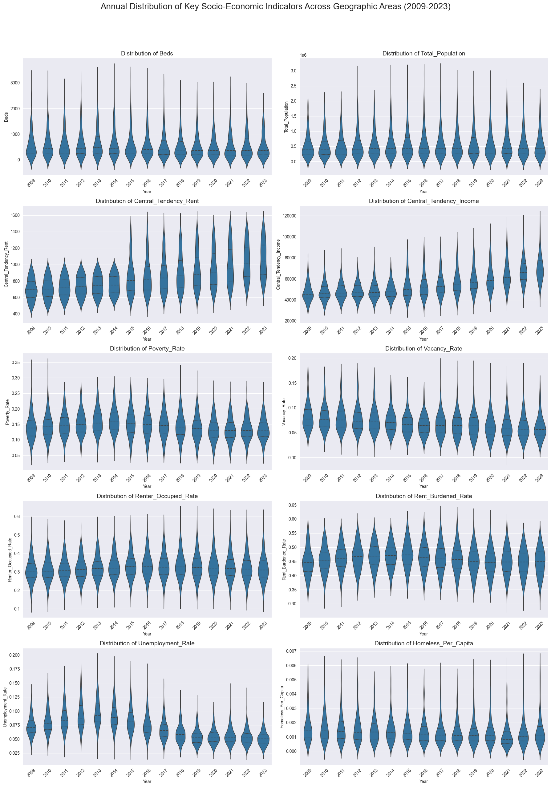
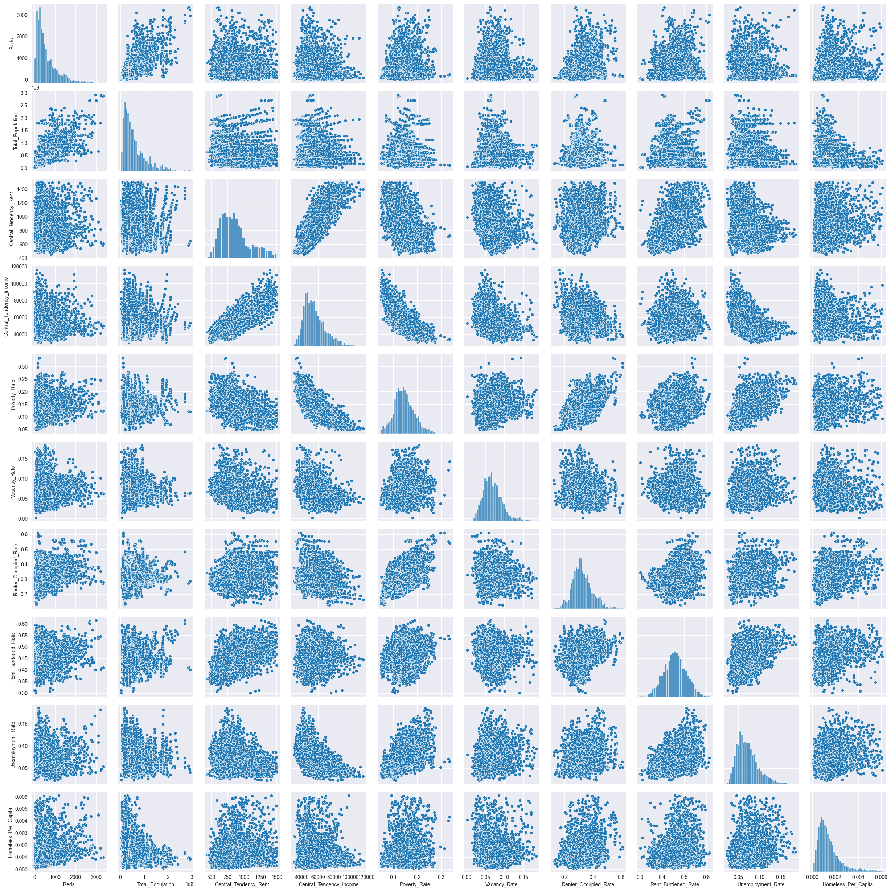
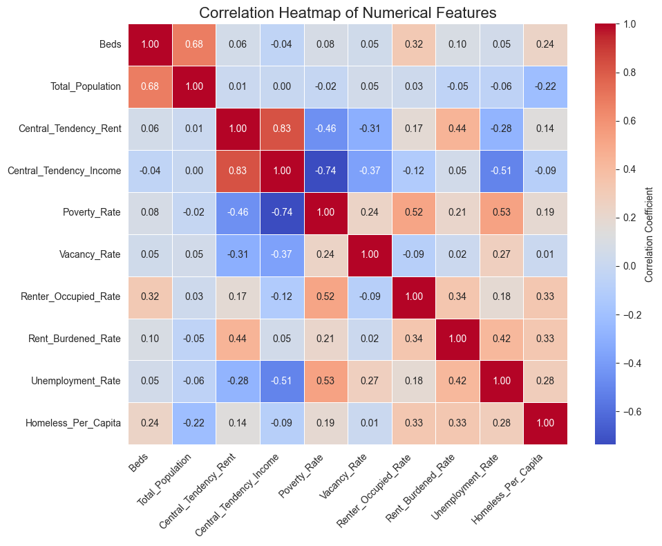

## Updated Task Schedule

There was significant modification to the original plan, including reduced scope and due dates moved back. These modifications were caused by significant unforseen complexities in obtaining the dataset. The revised plan with updated due dates is below along with current completed tasks.

| Week Number  | Original Due Date   | Task| Completed Date | Pending Due Date |
|--------------|------------|------|----------|---------|
| Week 1       | Sept. 27th | Gather ACS Tables| Oct. 31 | |
|        |  | Merge ACS Tables, Coc Counts, NOAA Weather Data| Oct. 31| |
| Week 2       | Oct. 4th   | Create Per Capita and other Features| Oct. 31| |
|        |    | Determine Type of Variables| Nov. 8| |
|        |    | Identify outliers and any data issues| Nov. 8| |
|        |    | Apply Transformations| Nov. 8| |
|        |    | Handle missing values| Nov. 8| |
|        |    | Describe data variable statistics| Nov. 8| |
| Week 3       | Oct. 11th  | Visualize Data| Nov. 8 | |
|        |   | Point out interesting relationships and patterns from visualizations| Nov. 8 | |
| Week 4       | Oct. 18th  | 5 page Write-Up| Nov. 8 | |
| **Report 2**     | **Oct. 25th**  |   | Nov. 8 | |
| Week 5       | Oct. 25th  | Explain CatBoost, Extra Trees Regressor, and K-Neighbors Regressor Include model assumption advantages and disadvantages of each method | | Nov. 19 |
| |            | Describe any feature creation|| Nov. 19 |
|        |   | Explain the selection process and cross-validation used|| Nov. 19 |
|        |   | Explain bias variance trade-off|| Nov. 19 |
| Week 6       | Nov. 1st   | Construct CatBoost Model|| Nov. 19 |
|        |    | Construct Extra Trees Regressor Model|| Nov. 19 |
|        |    | Construct K-Neighbors Regressor Model|| Nov. 19 |
| Week 7       | Nov. 8th   | Tune Model Hyperparameters|| Nov. 19 |
|        |    | Interpret model coefficients and feature importance|| Nov. 19 |
| Week 8       | Nov. 15th  | 5 Page Write-Up|| Nov. 19 |
| Week 9       | Nov. 23rd  | Presentation Slides|| Nov. 19 |
| **Presentation** | **Nov. 23rd**  |   || Nov. 19 |
| **Final Report** | **Nov. 30th**  |   |

## Acquiring PIT Count Data
The file [PIT_count_preparation.ipynb](Notebooks/PIT_count_preparation.ipynb) acquires annual Point-in-Time (PIT) Homeless Count data.  Sourced from a downloaded excel file (2007-2024-PIT-Counts-by-CoC.xlsb). The script uses the pandas library to read all sheets and then iterates through them, selecting sheets with year names between 2009 and 2024. For each selected year, a 'year' column is added. The data from these annual sheets is then concatenated, and a specific subset of nine key columns is selected to create a new dataset. The script cleans this dataset by dropping rows with more than four missing values to remove non-CoC-count information. Finally it saves the dataset into a CSV file.

## Acquiring HIC Count Data
The [HIC_count_preparation.ipynb](Notebooks/HIC_count_preparation.ipynb) file processes annual Homeless Inventory Count (HIC) data. The data from 2007 to 2024 is from a multi-sheet Excel file named 2007-2024-HIC-Counts-by-CoC.xlsx. Using the pandas library, the code iterates through each sheet extracting the relevant data, and renames the first two columns. Next, the code adds a column to each DataFrame saving the year information. The DataFrames representing each year are concatenated into a single DataFrame called HIC_count. Finally, the dataset is saved to a CSV file named "hic_counts.csv".

## Acquiring ACS Data

The Jupyter Notebook, [Acquire_ACS_Data.ipynb](Notebooks/Acquire_ACS_Data.ipynb), acquires, validates, and processes American Community Survey (ACS) demographic and housing indicators from the U.S. Census Bureau API. This output enables the application of advanced machine learning techniques.

### Methodology and Validation

The download_variables function serves as the foundation for the acquisition process. This function executes the numerous required API calls by generating the full Cartesian product of all desired ACS variables and the targeted time period. The function then unifies the raw results into a single dataframe, indexed by identifiers (GEOID and Year). The function find_all_missing_years validates the documented variables by comparing the expected variables with the retrieved metadata. This process signifies which variables require alternative calculation strategies.

### Addressing Missing Years

The calculation of Median Rent for a 2-bedroom apartment was the most significant complexity addressed for these variables. Since the direct ACS variable (B25031_004E) was absent for the initial years (2009–2014), the notebook downloaded a related set of variables that provide grouped frequency data (counts of units within discrete rent brackets) and applied the standard linear interpolation formula for grouped data: 
$$Median = L + \frac{\frac{n}{2} - F}{f} \times w$$
This statistical method provided a median estimate for the missing period, which the notebook subsequently affirmed by comparison with the actual ACS-reported values during the years of overlap.
Other variables needing correction were the Poverty Rate, Vacancy Rate, and Renter Occupied Rate, which were mathematically constructed by summing their component count variables.

The notebook addressed inconsistencies in the Rent Burdened Rate, a measure of renter households paying over $30\%$ of income toward rent, by correcting for a documentation error that mistakenly referenced owner-occupied units. The function find_all_missing_years indicated that the corrected variables were missing from 2009. The notebook downloads other consistently available variables. 
The final, and perhaps most granular, effort involved the Unemployment Rate, which lacked data for the 2009-2010 period. To produce a seamless dataset, the notebook manually aggregated and summed the counts of the unemployed and the labor force across numerous age and gender-specific cohorts to reconstruct the total figures for the missing years.

The culmination of this entire notebook is the production of a single, unified ACS_data.csv DataFrame. This consolidated resource represents a validated, temporally consistent, and reproducible input dataset.

## Aggregating and Merging Datasets

The Jupyter notebook [merge_datasets.ipynb](../Notebooks/merge_datasets.ipynb) includes a multi-step workflow for merging and aggregating three distinct datasets. The Point-in-Time (PIT) counts, Housing Inventory Count (HIC) data, and American Community Survey (ACS) data are merged into one single dataset. The core challenge is addressing the mismatch between the geographic boundaries of the CoC (Continuum of Care) areas (used by the PIT and HIC data) and the GEOID/County FIPS areas (used by the ACS data).

To resolve this geographic discrepancy, the notebook first reads a separate county_coc_match.csv file that serves as a bridge between County FIPS codes and CoC numbers. Using the networkx library, it constructs a network graph in which edges connect the associated County FIPS and CoC Numbers. This network is then analyzed to identify 347 connected components, or "Groups," each representing a collection of counties and CoCs whose boundaries overlap or are coterminous. A lookup map is created to assign a unique Group_Number to every County GEOID and CoC Number in the three primary datasets.

The final stage of the notebook involves aggregating the data by the newly created Group_Number and year. The ACS data is aggregated using summation for numerators and mean for central tendencies. The PIT and HIC datasets (which contain homeless and bed counts) are aggregated by summation. Finally, these three aggregated dataframes are merged on Group_Number and year to form the Final_Data_Set. The notebook then calculates final rates using the aggregated numerators and denominators, and saves the resulting unified dataframe to a CSV file.

## Visualizations

### Histograms

This visualization shows ten different histograms. Each histogram shows the distribution of a variable in the dataset across geographic areas and the years of interest. By analyzing their shapes, skewness, central tendency, and spread, we can group these metrics into distinct distribution categories.

The first group, Distribution of Beds, Distribution of Total Population, and Distribution of Homeless_Per_Capita, exhibits a strong right skew. Most values appear clustered on the low end, and the distribution trails off sharply, extending to a few small values at the high end. A small number of geographic area/year combinations have extremely high values. For these variables, the median is significantly lower than the mean, and there are a small number of large values compared to a large number of small values.

The second group, Central_Tendency_Rent, Central_Tendency_Income, Poverty_Rate, Vacancy_Rate, and Unemployment_Rate, shows a moderate right skew but has a much more gradual decline than the first group. These distributions resemble a slightly stretched bell curve, where the drop-off is not as severe and a significant portion of the data falls in the midrange.

Finally, the distributions of Renter_Occupied_Rate and Rent_Burdened_Rate stand out as the only approximately symmetric distributions. The lack of extreme skewness here suggests that the overall variation across entities is relatively balanced, unlike that of the other eight variables.

### Box Plots

Overall, the boxplots summarize the distributions of the data, revealing that most metrics are positively skewed, with the greatest differences in skew severity and the number of extreme outliers. Again, the boxplots reveal three main groupings of variables: one group with extreme right skew, one with moderate right skew, and one nearly symmetrical.

### Violin Plots

These ten violin plots visualize the annual distribution of socio-economic indicators. They provide insight into how the spread and central tendency of these metrics have evolved. The wider the violin is, the more common that value is in the data set. The innermost line marks the median, and the outer two lines represent the interquartile range (IQR).

A strong trend across all ten metrics is the consistency and stability of their underlying distributions over the entire 15-year period. In most plots, the overall shape and skewness of the violins remain virtually unchanged year-over-year. The distributions for Beds, Total_Population, and Homeless_Per_Capita exhibit an extreme right skew across all years, with the bulk of the data clustered at the low end and a very long, thin tail extending upward to high values. Conversely, metrics like Renter_Occupied_Rate, Rent_Burdened_Rate, and Unemployment_Rate exhibit more symmetric, centrally distributed patterns across all years, with most data points clustered in a tighter middle range.

Despite the stable shape, several metrics show clear, progressive trends in their central tendency (median) over time. Central_Tendency_Rent and Central_Tendency_Income both show a consistent upward trend in their median values and the overall distribution location, reflecting general economic growth and/or inflation. In contrast, Unemployment_Rate generally shows a downward trend in its median after the initial years, indicating an improvement in employment. The spread for most indicators, such as Poverty_Rate and Vacancy_Rate, remains relatively uniform across years.

### Scatter Plots

The pairwise scatter plot reveals several strong and weak correlations among the variables. Poverty Rate and Median Income display a negative linear correlation. Poverty Rate also shows a strong positive correlation with the Unemployment Rate. These correlations showcase the predictable relationship between economic hardship and joblessness. Relationships involving housing costs are complex; while Median Gross Rent generally rises with Median Income, the scatter increases dramatically at higher income levels, indicating greater variability in high rents. In contrast to these tightly coupled variables, the Vacancy Rate shows minimal to no correlation with nearly all other socio-economic factors, appearing largely independent of both the economic health and the ownership status of the regions under study.

### Heatmap

This visualization is a correlation heatmap showing the linear relationships between ten numerical features.

The heatmap highlights several key relationships. The strongest positive correlation is between Central_Tendency_Rent and Central_Tendency_Income. This indicates that areas with higher average income tend to have higher average rents. The strongest negative correlation is between Poverty_Rate and Central_Tendency_Income, which is an expected inverse relationship: areas with higher average incomes tend to have lower poverty rates. Additionally, Beds and Total_Population show a strong positive correlation, suggesting that shelter bed capacity scales with population size. 

Several other relationships are consistent with expected economic dynamics. Because high joblessness often leads to higher poverty it is expected that Poverty_Rate shows a moderate positive correlation with Unemployment_Rate. Conversely, Poverty_Rate is moderately negatively correlated with Central_Tendency_Rent and Vacancy_Rate, suggesting that areas with lower rent and fewer vacant units might have higher poverty. The Rent_Burdened_Rate exhibits a moderate positive correlation with Central_Tendency_Rent and Unemployment_Rate, indicating that high rent and high joblessness contribute to households being burdened by rent costs.

Many variables show very weak or negligible correlation. As an example, Total_Population has near-zero correlation with almost all other socio-economic indicators, implying that simply having a large population doesn't strongly predict the area's poverty or income levels.
